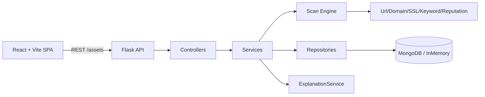

# ScamShield

<p align="center">
  
  <br/>
  <strong>ScamShield — Explainable AI for Multi‑Modal Scam Detection</strong>
</p>

<p align="center">
  <em>Inspect phishing URLs, scam emails, SMS, fake news, and multimedia with an explainable scanner and threat intelligence workflow.</em>
</p>

---

## Badges

| Component | Status |
|---|---|
| Python |  |
| Frontend |  |
| Database |  |
| Deployment |  |
| License | MIT |

---

## Overview

ScamShield is a full‑stack reference implementation for analyst-friendly scam detection. It pairs a modular Flask backend with a React + Vite single page app to provide deterministic, explainable checks across multiple content types:

- URLs (structural and heuristic analysis)
- Text (email, SMS, news) with urgency, credential and reward signals
- Images and video metadata with pixel-level heuristics (Pillow optional)
- Threat intelligence records and a paginated history repository

The codebase emphasizes observability, extendability, and clear separation of concerns (controllers → services → repositories → detection engine).

---

## Why ScamShield?

- Provides interpretable detection indicators (names, details, matches) rather than an opaque score.
- Integrates threat telemetry to track repeated malicious domains and summarize historical risk.
- Designed for rapid local development (in-memory DB fallback) and production deployment (MongoDB + Render).

---

## Live Demo

Explore the deployed demo:

https://phishing-url-xjgv.onrender.com

---

## Key Features

| Feature | Implemented |
|---|---:|
| URL structural analysis (HTTPS, IP host, long URL, shorteners) | ✅ |
| Text analysis (email, SMS, news) with urgency/authority/reward signals | ✅ |
| Image AI-generation/deepfake checks via optional Sightengine ML models | ✅ |
| Image forensic heuristics (entropy, noise, EXIF) — Pillow optional | ✅ |
| Media upload endpoint with metadata support (width/height/duration) | ✅ |
| Threat intelligence domain records & top threats listing | ✅ |
| Scan history (MongoDB-backed, paginated) with in-memory fallback | ✅ |
| JWT-based auth flows + demo legacy session | ✅ |

> The table lists only functionality implemented in the repository.

---

## Technology Stack

- Frontend: React 18, Vite, modern ES modules
- Backend: Python (3.10+), Flask (app factory, blueprints)
- Persistence: MongoDB (pymongo) with in-memory fallback for local runs
- Detection: Deterministic analyzers implemented in Python (`scamshield.detection`, `scamshield.ai.detector`)
- Dev/Deployment: Render config and `Procfile` included

---

## Architecture (high level)



---

## AI Detection Pipeline

1. Input normalization (URL scheme, text trimming)
2. Rule-based analyzer chain (URL analyzer → domain/ssl/keyword/reputation analyzers)
3. Findings aggregation and scoring (risk score → label)
4. Explanation composition via `ExplanationService`
5. Persistence: `ThreatIntelligenceService` and `HistoryRepository`

Notes:
- Production URL and content detection uses explainable heuristic analyzers; it does not load a trained machine-learning model.
- News content uses a two-tier signal when `GOOGLE_FACT_CHECK_API_KEY` is configured: the Google Fact Check Tools API first looks for independently reviewed claims and can confirm or override the keyword result. When no reviewed claim is found, ScamShield falls back to keyword/style heuristics that detect sensationalist writing, not verified truth.
- `GOOGLE_FACT_CHECK_API_KEY` is optional. Leave it unset for a fast keyword-only fallback; API failures and unavailable results degrade gracefully without blocking analysis.
- The offline Random Forest trainer is retained at `experiments/train_model.py` with its dependencies in `requirements-experiments.txt`. It is not part of the live application pipeline.
- Image analysis uses two signals: when `SIGHTENGINE_API_USER` and `SIGHTENGINE_API_SECRET` are configured, Sightengine's `genai` and `deepfake` models provide an independent ML signal that can confirm or override weaker forensic evidence. The existing forensic checks in `scamshield/ai/detector.py` always run as a second signal, covering EXIF metadata, pixel entropy, noise, edge detection, and filename patterns.
- Sightengine credentials are optional and available for free at https://sightengine.com. Missing credentials or an API failure gracefully degrades to forensic-heuristics-only analysis.
- Video analysis is currently forensic/heuristic-only. Sightengine is not called for video; frame-level deepfake video detection is a known future improvement.

---

## Folder Structure (abridged)

```
. 
├─ README.md
├─ app.py
├─ scamshield/
│  ├─ __init__.py
│  ├─ app.py
│  ├─ config.py
│  ├─ controllers/
│  ├─ routes/
│  ├─ services/
│  ├─ repositories/
│  ├─ ai/
│  ├─ detection/
│  ├─ analysis/
│  ├─ middleware/
│  └─ utils/
├─ frontend/
│  ├─ src/
│  ├─ dist/
│  └─ package.json
├─ scripts/
├─ requirements.txt
├─ render.yaml
└─ tests/
```

---

## Installation

Prerequisites:

- Python 3.10+
- Node.js 18+ and npm
- (Optional) Pillow for image forensic analysis

Backend (recommended):

```bash
python -m venv .venv
# Activate virtualenv
# Windows PowerShell: . .venv\Scripts\Activate.ps1
# macOS / Linux: source .venv/bin/activate
pip install -r requirements.txt
```

Frontend:

```bash
cd frontend
npm ci
```

---

## Environment Variables

Configure production secrets and DB connectivity via environment variables. Key values (see `scamshield/config.py`):

- `SECRET_KEY`, `JWT_SECRET_KEY` — set explicit secrets before production
- `MONGODB_URI` — optional; without it the app uses the in-memory fallback
- `DATABASE_NAME`, `FRONTEND_BASE_URL`, `DEMO_EMAIL`, `DEMO_PASSWORD`

Rate limiting & auth:

- `API_RATE_LIMIT_MAX_REQUESTS`, `API_RATE_LIMIT_WINDOW_SECONDS`
- `LOGIN_MAX_FAILED_ATTEMPTS`, `JWT_EXPIRATION_MINUTES`

---

## Running Locally

Build production frontend (optional for Flask-served assets):

```bash
cd frontend
npm ci
npm run build
cd ..
```

Start Flask (development):

```bash
export FLASK_APP=scamshield
export FLASK_ENV=development
flask run
```

On Windows (PowerShell):

```powershell
set FLASK_APP=scamshield
set FLASK_ENV=development
flask run
```

For fast frontend iteration:

```bash
cd frontend
npm run dev
# Visit http://localhost:5173
```

---

## API Overview (implemented endpoints)

All APIs are under `/api` unless otherwise noted.

- GET `/api/health` — health and database backend mode
- GET `/` — frontend index (serves built `frontend/dist` in production)

Authentication (blueprint `auth_bp`):

- GET `/api/auth-status` — legacy demo session auth status
- POST `/api/login` — demo legacy login
- POST `/api/logout` — demo logout
- POST `/api/auth/register` — JWT user registration
- POST `/api/auth/login` — JWT login
- POST `/api/auth/refresh` — token refresh
- GET `/api/auth/me` — protected current user (middleware)

Scanning (blueprint `scan_bp`):

- POST `/check-url` and `/api/check-url` — lightweight URL check
- POST `/api/analyze` — analyze text content (`content`, `content_type`)
- POST `/api/analyze-file` — multipart file + optional transcript
- POST `/api/analyze-media` — image/video multipart upload (file, width, height, duration)
- POST `/api/scan/url` — protected full URL scan + record threat intelligence
- GET `/api/scans/history` — paginated history
- DELETE `/api/scans/<scan_id>` — protected delete

Threat Intelligence (blueprint `threat_bp`):

- GET `/api/threats/domain/<domain>` — lookup domain intel
- GET `/api/threats/top` — list top risky domain records

Dashboard:

- GET `/api/dashboard` — aggregated metrics and telemetry for the frontend

---

## Screenshots

<center>


</center>

<center>


</center>

<center>


</center>

<center>


</center>

<center>


</center>

<center>


</center>

---

## Project Workflow

- Frontend calls client services in `frontend/src/services/*` to interact with the Flask API.
- Controllers validate incoming requests, services orchestrate detection and storage, and repositories interact with MongoDB (or in-memory fallback).
- The `ScanService` coordinates analyzers, explanations, and persistent records.

---

## Security Features

- Config validation prevents starting in production with default secrets.
- JWT authentication and refresh flows protect sensitive endpoints.
- Login rate limiting and failed attempt handling.
- Configurable CORS and DB backend mode awareness.

---

## Future Roadmap (repository-grounded)

- Frame-level deepfake video model pipeline (recommended, not implemented).
- OCR / speech-to-text integration for richer media analysis (not implemented).
- CI/CD hardening and automated dependency/CVE scanning.
- Admin UI for threat intelligence management and RBAC improvements.

---

## Contributing

1. Fork the repository
2. Create a branch: `git checkout -b feature/your-change`
3. Run tests: `pytest -q`
4. Build frontend if applicable: `cd frontend && npm ci && npm run build`
5. Open a PR with clear rationale

Please follow the repository's layering conventions (controllers → services → repositories).

---

## License

ScamShield is available under the MIT License. See `LICENSE`.

---

## Developer

Sai Mohan — https://github.com/GOLLE-SAIMOHAN/ScamShield

---

## Quick Examples

Analyze a URL (curl):

```bash
curl -X POST "http://localhost:5000/api/check-url" \
  -H "Content-Type: application/json" \
  -d '{"url":"http://suspicious.example/login"}'
```

Analyze text (email):

```bash
curl -X POST "http://localhost:5000/api/analyze" \
  -H "Content-Type: application/json" \
  -d '{"content":"Dear customer, your account is suspended. Verify now.","content_type":"email"}'
```

Upload media (image):

```bash
curl -X POST "http://localhost:5000/api/analyze-media" \
  -F "file=@/path/to/image.jpg" \
  -F "width=1200" \
  -F "height=800"
```

---

All documentation above reflects implemented code paths and configuration in this repository.
